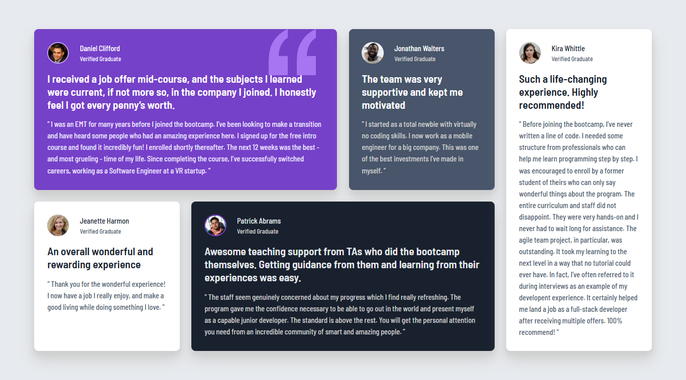

# Frontend Mentor - Four card feature section solution

This is a solution to the [Four card feature section challenge on Frontend Mentor](https://www.frontendmentor.io/challenges/four-card-feature-section-weK1eFYK). Frontend Mentor challenges help you improve your coding skills by building realistic projects. 

## Table of contents

  - [The challenge](#the-challenge)
  - [Screenshot](#screenshot)
  - [Links](#links)
  - [Built with](#built-with)
  - [What I learned](#what-i-learned)
  - [Useful resources](#useful-resources)
  - [Author](#author)

### The challenge

Users should be able to:

- View the optimal layout for the site depending on their device's screen size

### Screenshot




### Links

- Solution URL: [Add solution URL here](https://github.com/nouranelfar/Testimonials-grid-section)
- Live Site URL: [Add live site URL here](https://nouranelfar.github.io/Testimonials-grid-section/)

### Built with

- Semantic HTML5 markup
- CSS custom properties
- Flexbox
- CSS Grid
- Mobile-first workflow
- [sass](https://sass-lang.com) - For styles


### What I learned

```css
.proud-of-this-css {
  font-size: clamp(0.9rem, 0.85rem + 0.2vw, 1.1rem);
}
```


### Useful resources

- [ sass ](https://sass-lang.com/guide/) - This helped me for fast styling.


## Author

- Frontend Mentor - [@nouranelfar](https://www.frontendmentor.io/profile/nouranelfar)